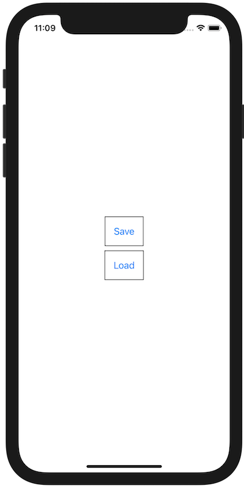

+++
title =  "Swiftで文字列を圧縮して保存し、そのデータを読み取る"
url = "2021-01-01"
date = "2021-01-01"
description = "Swiftで文字列を圧縮して保存し、そのデータを読み取る"
tags = [
  "iOS",
  "SwiftUI"
]
categories = [
  "iOS",
  "SwiftUI"
]
archives = "2020/12"
aliases = ["migrate-from-jekyl"]
+++

<br>

Swiftで文字列を圧縮して保存し、そのデータを読み取る方法です。
zlib というアルゴリズムで文字列を圧縮し、保存しています。
Java の `Deflater`, `Inflater` に相当する方法ですが、header、チェックサムの情報が抜けている生のデータが保存されるので気をつける必要があります。




```
static void saveCompressedData() {
    try {
        // Encode a String into bytes
        String text = "hello";
        byte[] data = text.getBytes(StandardCharsets.UTF_8);

        // Compress the bytes
        ByteArrayOutputStream byteArrayOutputStream = new ByteArrayOutputStream();
        DeflaterOutputStream outputStream = new DeflaterOutputStream(byteArrayOutputStream);
        outputStream.write(data);
        outputStream.finish()
        String path = "/Users/kabigon/Desktop/data.data";
        try (FileOutputStream fos = new FileOutputStream(path)) {
            fos.write(byteArrayOutputStream.toByteArray());
        }

        System.out.println("----------------------");
        System.out.println("Save Completed!!");
        System.out.println(String.format("Path: %s", path));
        System.out.println("----------------------");
    } catch (Exception e) {
        e.printStackTrace();
    }
}
```


```
----------------------
Java: [120, -100, -53, 72, -51, -55, -55, 7, 0, 6, 44, 2, 21]
Swift: [-53, 72, -51, -55, -55, 7, 0]
----------------------
```


参考: [NSData > compressed(using:)](https://developer.apple.com/documentation/foundation/nsdata/3174960-compressed)

<!-- Google Ads -->


<!-- Amazon Ads -->



